# VMware Active Directory Project

# Overview

**Building My Own Active Directory Homelab**

I set out to build a real, working Active Directory environment from scratch to get hands-on with the kind of infrastructure I'd be managing in an IT support or sysadmin role. Instead of just reading about AD concepts, I wanted to actually build one, break it, fix it, and document the whole process.

**What I built:**

- A Windows Server 2022 Domain Controller, set up from a clean install
- A new AD forest and domain (`benlab.local`)
- An OU structure organized the way a real company might be (IT, Sales, HR)
- User accounts and security groups, with hands-on practice managing them (resets, disabling, moving between OUs)
- A Windows 11 client machine joined to the domain
- Full authentication testing both as a domain admin and as a regular user, including the forced password change flow

**Tools I used:**

- **VMware Workstation Pro 17** for virtualization
- **Windows Server 2022 Standard (Desktop Experience)** for the Domain Controller
- **Windows 11 Enterprise (eval)** for the client
- An isolated host-only network (VMnet1) so the whole lab runs self-contained, no internet needed

**Why I did this:** A lot of AD knowledge is easy to talk about in an interview but hard to actually prove without enterprise access. I wanted something I could point to and say "here, I built this myself, and here's exactly how it works" screenshots and all, not just theory.

# Network Architecture

Before touching Active Directory itself, I needed a clean, isolated network for the lab to live on — something that wouldn't touch my home network but would let the Domain Controller and client talk to each other freely.

**What I set up:**

- Used VMware's **VMnet1 (Host-only)** network, which keeps traffic contained between VMs and the host machine, with zero access to my home LAN or the internet
- Disabled VMware's built-in DHCP service on VMnet1, since I wanted the DC to eventually control DNS and I didn't want two DHCP-like services stepping on each other
- Assigned static IPs to both machines instead of relying on automatic addressing, since a Domain Controller needs a stable, predictable address:

| Machine | IP Address | Role |
| --- | --- | --- |
| DC01 | 192.168.133.10 | Domain Controller / DNS Server |
| Client01 | 192.168.133.21 | Domain-joined client |

**Why isolate the network:** Keeping this lab fully self-contained meant I could experiment freely — join/unjoin machines, test authentication, even break things — without any risk to my actual home network or needing internet access at all. It's also just a more realistic mirror of how a segmented internal network works in a real environment.

**Verifying connectivity:** Before attempting the domain join, I confirmed Client01 could reach DC01 both at the network level (`ping`) and at the DNS level (`nslookup benlab.local`) — since AD relies heavily on DNS to function, this was an important checkpoint before moving forward.

Client01: IPConfig

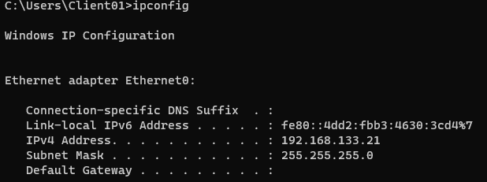

Client01: Ping

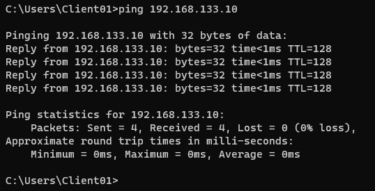

Clinet01: Nslookup benlab.local

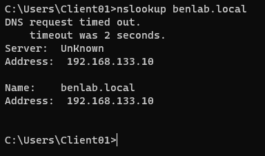

# Domain Controller Setup

With the network in place, the next step was turning DC01 from a plain Windows Server install into an actual Domain Controller.

**What I did:**

- Installed the **Active Directory Domain Services (AD DS)** role through Server Manager, along with the required management tools (AD Users and Computers, Group Policy Management, DNS tools)
- Promoted the server to a Domain Controller and created a **new forest** this is the step that actually establishes a brand new Active Directory environment from scratch, rather than joining an existing one
- Named the domain `benlab.local`, using `.local` specifically to avoid any conflict with a real internet domain
- Let the wizard install **DNS Server** alongside AD DS, since AD relies on DNS to function DC01 now resolves its own domain name and serves as the authoritative DNS server for the whole lab
- Set a DSRM (Directory Services Restore Mode) password during the setup a separate recovery credential used only if the DC ever needs to be restored from a backup state

**Why this matters:** The Domain Controller is the core of the whole environment it's what actually stores and manages every user, computer, and security group in Active Directory, and it's what every other machine on the domain trusts to verify logins. Getting this step right is what makes everything downstream (users, groups, client authentication) possible.

Dashboard:

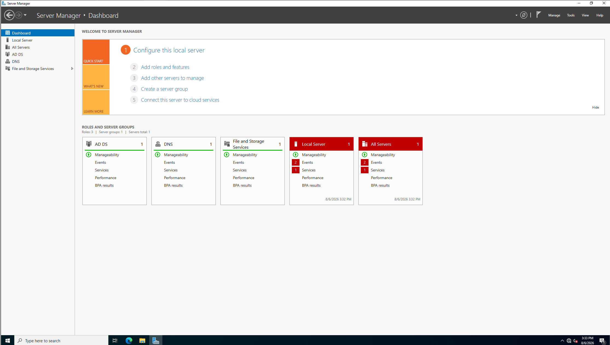

Local Server: 

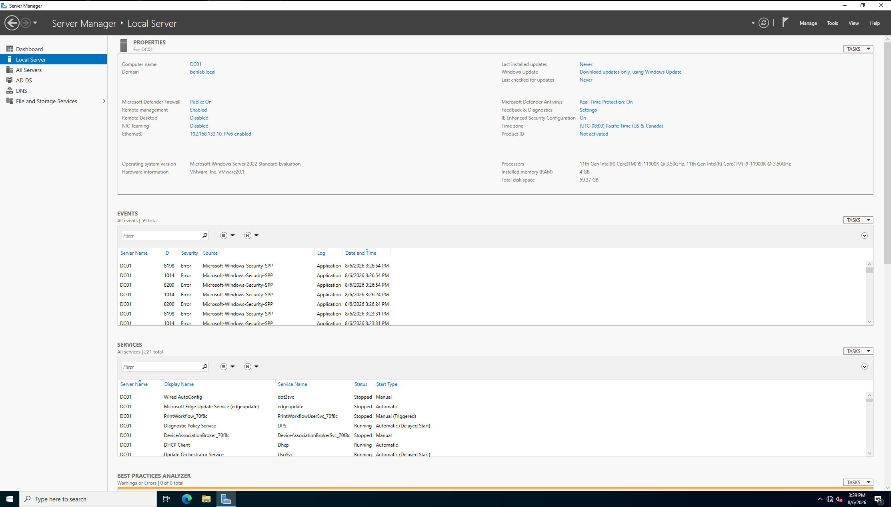

<aside>

Those are just Windows license-activation warnings — the server's an evaluation copy with no internet access since it's on an isolated lab network, so it can't phone home to activate. Doesn't affect functionality at all, just expected noise in an offline lab.

</aside>

AD DS: 

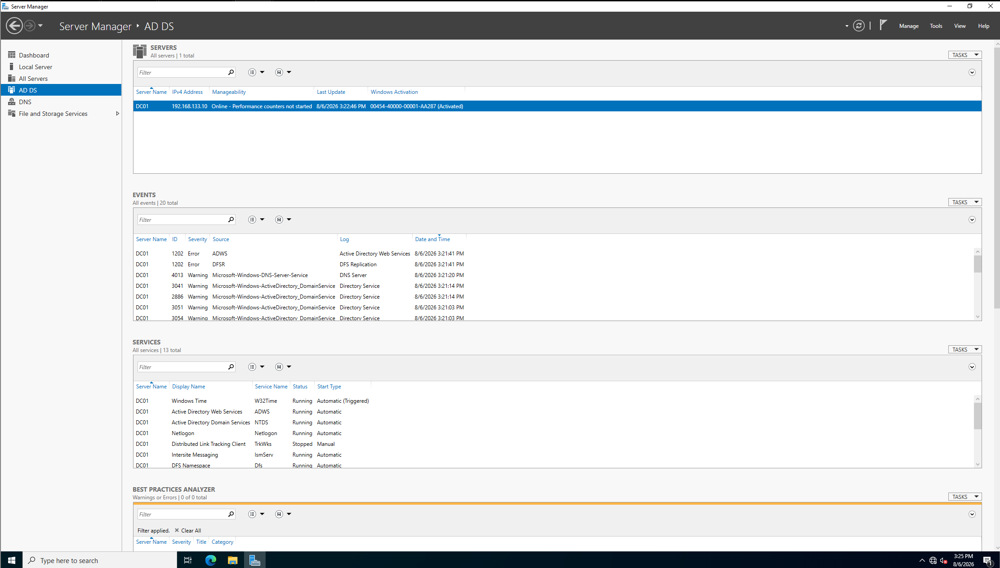

<aside>

One small thing worth noting for your own awareness (not necessarily something to fix): those two **Error** events at the top (ADWS and DFSR, both ID 1202) are common on single-DC labs — they're usually just replication-related warnings that only matter when you have *multiple* domain controllers to replicate between, which you don't in this lab. Not something you need to troubleshoot or worry about; if anyone asks about it in an interview, you can explain that context confidently (shows you can actually read event logs, not just screenshot them).

</aside>

DNS: 

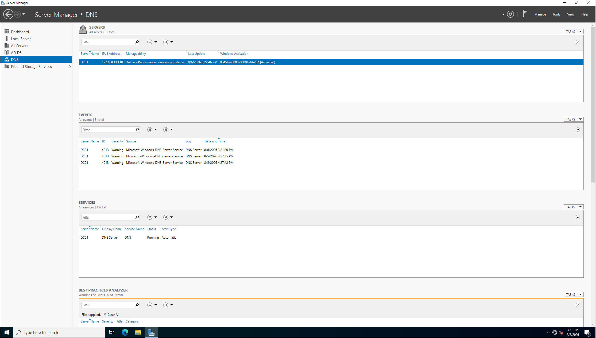

# Active Directory structure

**Organizing Active Directory: OUs, Users, and Groups**

Once the domain was live, the next step was building out a structure that actually reflects how a real company would organize its users not just dumping every account into the default "Users" folder.

**Organizational Units (OUs):**

I created OUs to represent different departments:

- `IT`
- `Sales`
- `HR`
- `_ServiceAccounts` (a common naming convention  the underscore sorts it to the top of the list, keeping service accounts separate and easy to find)

Each OU acts as a container that can hold its own users, computers, and group policies this is what lets an admin apply different settings or permissions to different parts of an organization without affecting everyone.

**Deletion protection:**

By default, every OU I created came with **"Protect object from accidental deletion"** enabled. I tested this firsthand when I tried deleting an OU, AD blocked me outright until I manually went into the OU's properties and unchecked that protection. It's a small feature, but a good one to understand: it's exactly the kind of safeguard that prevents a single misclick from wiping out an entire department's worth of accounts in a real environment.

**Security Groups:**

I created security groups (`IT-Admins`, `Sales-Team`) to manage access at the group level rather than assigning permissions to individual users one by one the standard best practice in real AD environments. I added users to these groups and verified the membership from both directions: from the group's Members tab, and from the user's own Member Of tab.

- AD Users and Computers
    
    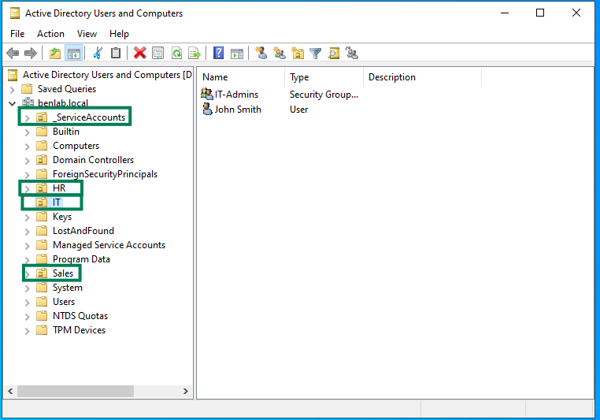
    

- OU Properties> Object Tab> Deletion Protection Checkbox
    
    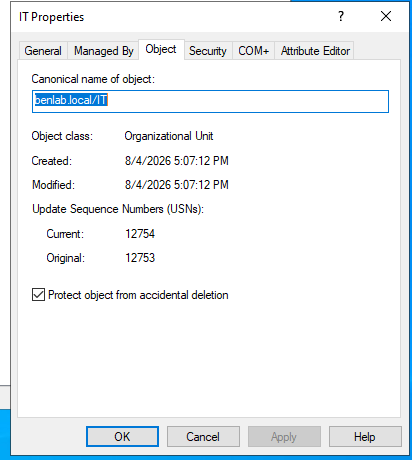
    

- IT-Admins Group Properties> Members Tab
    
    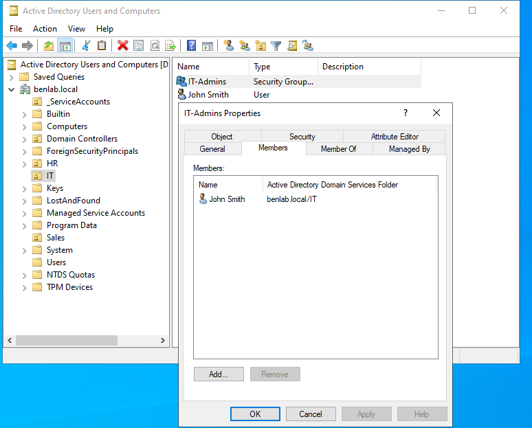
    

- John Smith- Member of Tab showing IT-Admins
    
    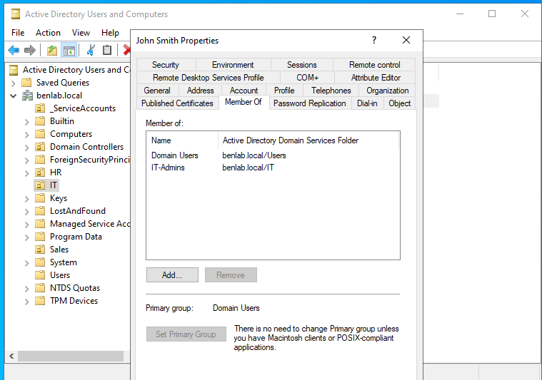
    

# User & Account Management

With the OU and group structure in place, I practiced the day-to-day account management tasks that make up most of a helpdesk or sysadmin role.

**Creating users:**

I created user accounts inside their respective OUs (e.g., John Smith under `IT`), rather than in the default Users container  keeping the structure consistent with how the OUs were designed to be used.

**Password resets:**

I reset John Smith's password and enabled **"User must change password at next logon"**  the standard workflow for an admin-initiated reset (new hire onboarding, forgotten password, post-incident reset, etc.). This flags the account so the next login forces a new password before granting access, which I later verified worked correctly when testing domain authentication from the client machine.

**Enabling/disabling accounts:**

I disabled and re-enabled John Smith's account to see the visual and functional difference  a disabled account shows a distinct icon in AD Users and Computers (a small down-arrow overlay) and cannot authenticate until re-enabled. This is a common action for offboarding or temporarily suspending access without deleting the account entirely.

**Moving users between OUs:**

I moved John Smith's account between OUs (`IT` → `Sales`) to simulate a real-world scenario like a department transfer, confirming the account retained its properties and group memberships throughout the move.

- Password Reset
    
    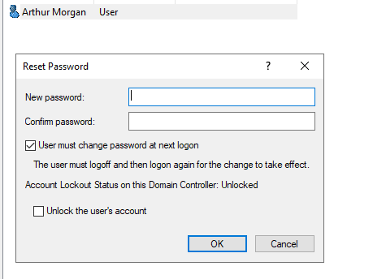
    
- Disabled Account
    
    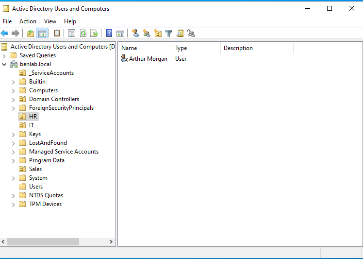
    

- OU Move Proof HR>IT
    
    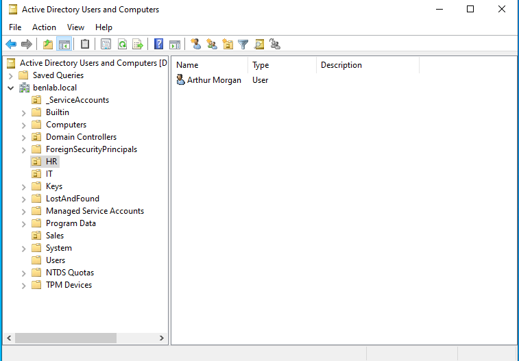
    
    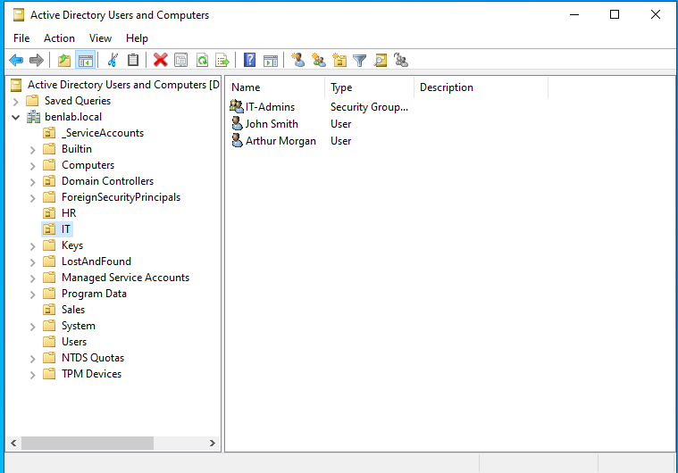
    

# Client Domain Join

**Joining Client01 to the Domain**

With the Domain Controller fully built out, the next step was proving the domain actually works by joining a real client machine and authenticating against it.

**Preparing Client01:**

- Installed Windows 11 Enterprise (evaluation) as the client OS
- Set the network adapter to the same isolated VMnet1 network as DC01
- Configured a static IP (`192.168.133.21`) with the preferred DNS server pointed at DC01 (`192.168.133.10`) this is the critical step, since domain join depends entirely on the client being able to resolve the domain through DNS
- Verified connectivity before attempting the join: confirmed `ping` reached DC01 and `nslookup benlab.local` correctly resolved to DC01's IP
- IPConfig on Client01:
    
    
    

**Joining the domain:**

- Through System Properties (`sysdm.cpl`), changed the computer from a workgroup to domain membership, entering `benlab.local`
- Authenticated the join using the domain Administrator credentials
- Received the "Welcome to the benlab.local domain" confirmation, then restarted the machine to complete the process
- Confirmation to “benlab.local domain:”
    
    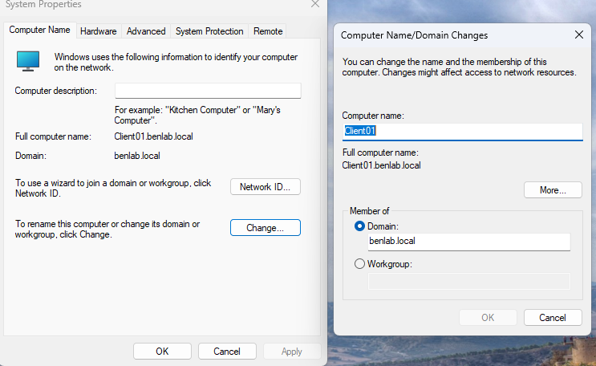
    

**One real troubleshooting moment worth noting:** My first attempt at building a client used Windows 10 Home, which I later discovered cannot join a domain at all that capability is stripped out of the Home edition entirely. I rebuilt the client VM using Windows 11 Enterprise instead, which resolved it. Small thing, but a good reminder that edition-level licensing limitations are a real consideration in IT work, not just a lab hiccup.

# Authentication Verification

The real test of whether any of this actually worked wasn't the wizards or the config screens it was whether a domain account could authenticate on Client01 and get real access. I tested this two ways: as a domain administrator, and as a standard domain user.

**Domain Administrator login:**

I logged into Client01 using `BENLAB\Administrator` at the lock screen (via "Other user"), rather than a local Client01 account. This confirms domain authentication end-to-end: Client01 reaches out to DC01 to verify the credentials before granting access it's not validating against anything stored locally on the client itself.

**Standard user login (John Smith):**

To test a more realistic scenario, I logged out and signed in as `BENLAB\jsmith`. Since his account had "User must change password at next logon" enabled from an earlier password reset, Windows immediately prompted him to set a new password before allowing access proof that account policies configured on the DC are actually enforced on the client, not just theoretical settings sitting in AD.

**Confirming the session:**

Once logged in as jsmith, I ran `whoami` from Command Prompt, which returned `benlab\jsmith` definitive confirmation, straight from the OS, that this is a domain-authenticated session and not a local account.

- BENLAB\Administrator
    
    
    

- Client01 Desktop as Admin
    
    
    
- Forced Password Change
    
    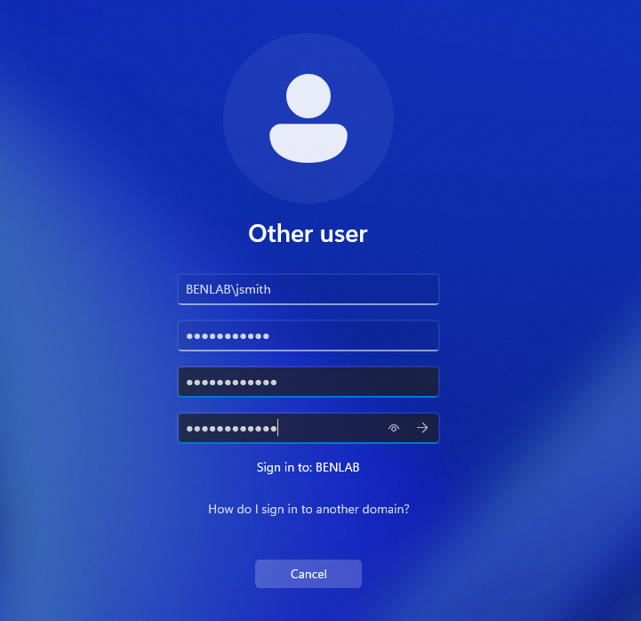
    

- Client01 Desktop
    
    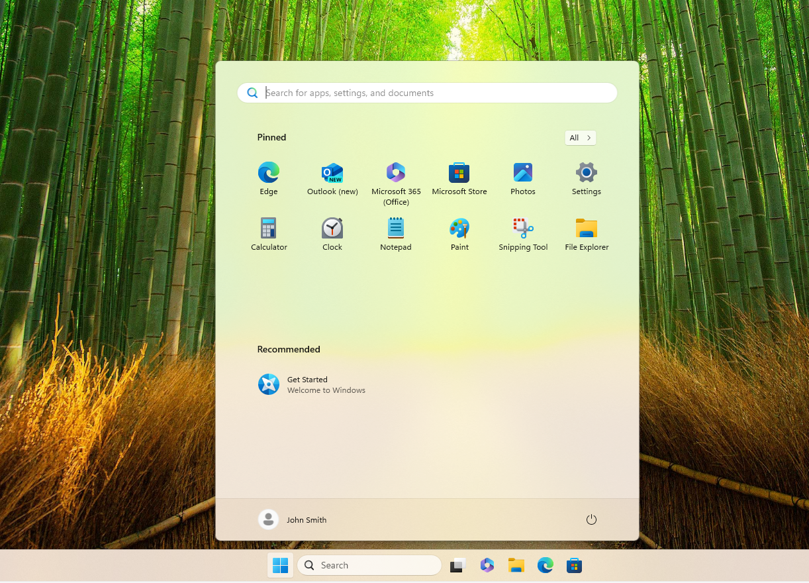
    

- WhoAmI Prompt
    
    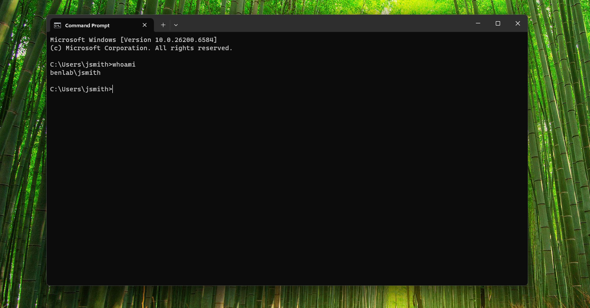
    

# Key Takeaways/ Skills Demonstrated

This project gave me hands-on experience with the core building blocks of Active Directory administration:

- **Domain Controller deployment** installed AD DS and DNS roles, promoted a server to a domain controller, and established a new AD forest from scratch
- **DNS configuration for domain services** configured and verified DNS resolution, understanding why AD depends on it functioning correctly for authentication and domain join to work
- **Network segmentation** built and configured an isolated virtual network with static IP addressing, avoiding DHCP conflicts and mirroring how internal network segments are managed in production environments
- **Organizational structure design** created OUs to reflect a realistic departmental hierarchy, understanding how OU structure supports scoped policy application and delegated administration
- **User and group account management** created, reset, disabled/enabled, and moved user accounts; built security groups and managed membership, following the group-based access model used in real environments
- **Client domain join and troubleshooting** joined a Windows 11 client to the domain, including diagnosing and resolving a real compatibility issue (Windows 10 Home's inability to join a domain)
- **Authentication verification** tested and confirmed domain login from both an administrative and standard user account, including verifying enforced account policies (forced password change) actually apply on the client side

**What I'd build next:** Group Policy Objects to centrally manage client settings, a second domain controller to explore AD replication, and potentially DHCP so the domain can hand out IP addresses dynamically instead of relying on static assignment.
